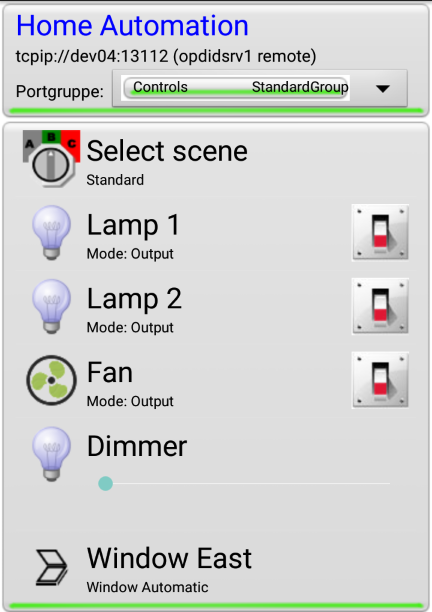
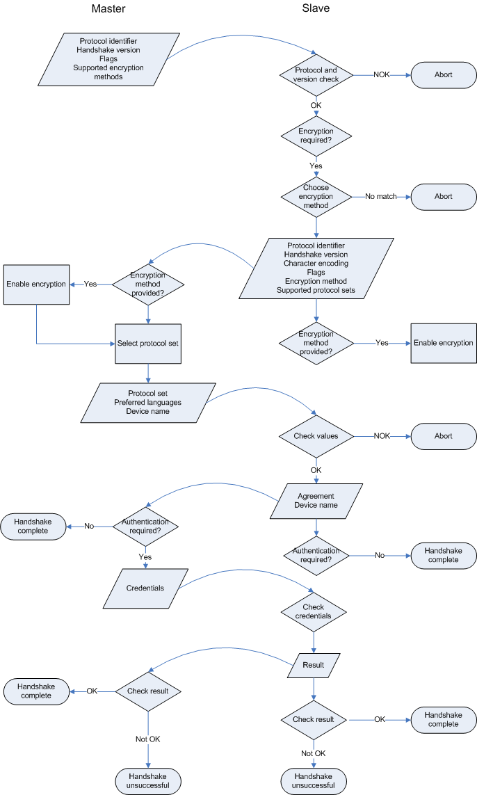

# opdi_core #

## Open Protocol for Device Interaction core implementations ##

*Please note: Code in this repository is under active development*

### Introduction ###

Welcome to the OPDI project. The Open Protocol for Device Interaction defines a communication protocol that can be used to interact with a variety of devices from small microcontrollers up to larger systems. It defines a few key concepts that simplify and standardize device functions in order to be able to control them via generalized UI elements. The protocol is designed to be lightweight, extensible and reasonably secure.

An OPDI server is called a "slave". Currently there are slave implementations for Windows, Linux (including Raspberry Pi), the Arduino IDE as well as Atmel 8 bit microcontrollers with at least 16 kB of flash ROM.
 
The software used to control an OPDI slave is called a "master". Currently there is a feature-complete implementation of an Android master that can be used to control slaves via Bluetooth or TCP/IP. There is also an incomplete C++ master.

Example screenshot of the Android master:

The repository structure is as follows:

	root
		code
			java						- contains the JAVA master implementation
				common					- JAVA OPDI library
				configs
					AndroPDI			- Android master control program
			c							- contains C and C++ implementations
				common					- OPDI base library (C, and C++ wrappers)
				configs					- actual slave and master implementations
					Arduino
						DoorControl		- example implementation: Bluetooth-controlled door opener
					ArduinoPDI			- Eclipse AVR/C++ project for Arduinos
					Chromashade			- Atmega16 4-channel LED PWM project (WinAVR)
					LinOPDI				- test implementation for Linux
					Poladisc			- Atmega16 4-channel LED PWM with stepper motor control (WinAVR)
					RaspOPDI			- test implementation for Raspberry Pi
					test				- common test code
					WinOPDI				- test implementation for Windows
				libraries				- support libraries for configs
				platforms				- platform specific implementations
		doc								- OPDI documentation

OPDI is used by the [OpenHAT automation server](https://github.com/leomeyer/OpenHAT) as its primary communications protocol.

### Key concepts ###

An OPDI **connection** has three stages. In the first phase, a master connects to a slave by exchanging some **handshake** messages. Negotiations about encryption, authentication, encoding, supported instructions, and language happen here. Basic device information such as device names are exchanged.

In the second phase the master enquires about the **capabilities** of the slave device. The slave tells it about its supported functions. The master uses this information to build a GUI that can be presented to a user.

The third phase is the interaction phase. User commands are accepted via the GUI and sent to the client by the master program. If necessary, the slave tells the master to **refresh** certain pieces of information on the GUI to reflect state changes.

While an OPDI connection with a master is active, a slave will not accept other concurrent connections. There are mechanisms like timeouts to ensure that a slave becomes available again when a master has been inactive or disconnected for some time.

There are currently two OPDI instruction sets: the "**basic protocol**" and the "**extended protocol**". The basic protocol supports the exchange of device information and control of device functions. The extended protocol also supports additional information (e. g., **units** that define icons and number formatting) plus some performance improvements. The basic protocol is used only on small microcontrollers with severe hardware limitations. Generally the extended protocol should be used.

OPDI has some hard-coded limits that need to be decided on when a slave is to be implemented. This includes the number of device functions that need to be managed by OPDI, plus the maximum string length of the protocol messages, among others. For small microcontrollers these contraints will be relatively tight. These definitions are called a "**configuration**", and the limits and other settings are defined in "configuration specifications", or "**config specs**" for short.

When a slave device starts up it registers its device functions with the OPDI system using the API provided by this library. It then runs the OPDI service listening function in a tight loop. When data arrives control is passed to the OPDI handshake handler which takes care of the connection. There is a callback function for housekeeping during a connection. For state changes another set of functions must be implemented by the slave. The OPDI system calls these functions when the respective messages arrive from the master and passes the control information to them.

### Ports ###

Device functions are represented in OPDI as so-called **ports**. Each port can be represented on a master's GUI as a separate GUI element. It will typically have an internal ID and a label (which might be language-dependent). It is not necessary that ports are really connected  to the "outside world". A port can also simply represent a flag or variable that controls  the behavior of the program running on the slave device.

There are five elementary types of ports:

#### Digital port ####

A Digital port is a port that can be either on or off (or **high** or **low**), and whose **state** is always known. Its **mode** can be **input**, **output**, or **both**. An Input Digital port typically represents a Digital pin of a microcontroller that is connected to a switch or other sensor. An output Digital port might represent an actor, such as a relay. 

A Digital port also supports **pullup** or **pulldown** resistors. OPDI allows the user to configure configure the Digital port's properties (mode, resistors and state) remotely if specified.

#### Analog port ####
 

An Analog port is modeled after the the properties of an A/D or D/A port of a microcontroller. Its value ranges from 0 to 2^n - 1, with n being a value between 8 and 12 inclusively. The Analog port also has a **reference** setting (internal/external), and a **mode** (input/output).

#### Dial port ####

A Dial port represents a 64 bit signed value. There's a minimum, maximum and a step setting which limit the possible values of a Dial port; for example, to represent an ambient temperature in degrees Celsius you could limit the range to -50..50.

If the value has to be presented to a user a conversion can take place in the UI component: The port's unit specification tells the UI what the value is exactly and what options there are for conversion and formatting. This also helps with localizing the UI; for example, even though the value is processed internally as tenths of degrees Celsius the UI might select to display it as degrees Fahrenheit, by means of a conversion routine specified for this unit.

#### Select Port ####

A Select port represents a set of distinct options (called **labels**). It lets the user choose one option at a time. Internally the options are The Select port's internal value is the index of its chosen option.   

#### Streaming Port ####

A Streaming port can be used to transfer text or binary data. Streaming ports implement bi-directional data streams that support the asynchronous exchange of arbitrary data. 

### Protocol details ###

#### Messages ####

OPDI is a message based protocol. Each message is terminated by a linefeed character (ASCII #10). A message has three parts: a so-called **channel** number, the actual message payload, and a checksum field. The parts are separated by a colon. Example:
 
	0:ping:0218

This is a ping message that is regularly sent from the master to the slave to tell the slave that the connection is still active. If the slave does not receive any messages from the master for some time it disconnects.

The channel number allows multiplexed messaging. The channel 0 is the **control channel** that is used for the initial handshake, keepalive and refresh messages. Channels 1 to 19 are reserved for asynchronous messaging using Streaming ports. Most messages, however use synchronous messaging using a channel number of 20 or higher. The actual channel number does not matter. As these messages are synchronous the reply is expected on the same channel, though. Example:

	20:gPI:DP2:029c

The master sends the gPI command ("get port information") for port "DP2" to the slave on channel 20. The slave responds, as well on channel 20, with information about the port: 

	20:DP:DP2:Testport Deny:2:0:0855

The multiplexing mechanism allows the slave to send other messages while the master waits for a reply to its command on channel 20. For example, it could signal an error on the control channel, or transfer data on a channel that has been bound to a Streaming port.

Channel numbers also play an important role in the detection of timeouts. The master takes care to send all messages whose origin is user interaction on channel numbers of 20 and higher. The slave resets its inactivity counter only when it receives a message on such a channel, but not below. This means that "maintenance communication", such as keepalive messages or automatic refreshes, do not interfere with detecting whether a user is still actively using a device or not.

#### Handshake ####

Without going too much into the details, here is a diagram of the initial handshake between master and slave:

OPDI currently supports AES encryption. AES uses a symmetric key which must be known to both slave and master.

The credential mechanism is currently a simple username and password login.

 